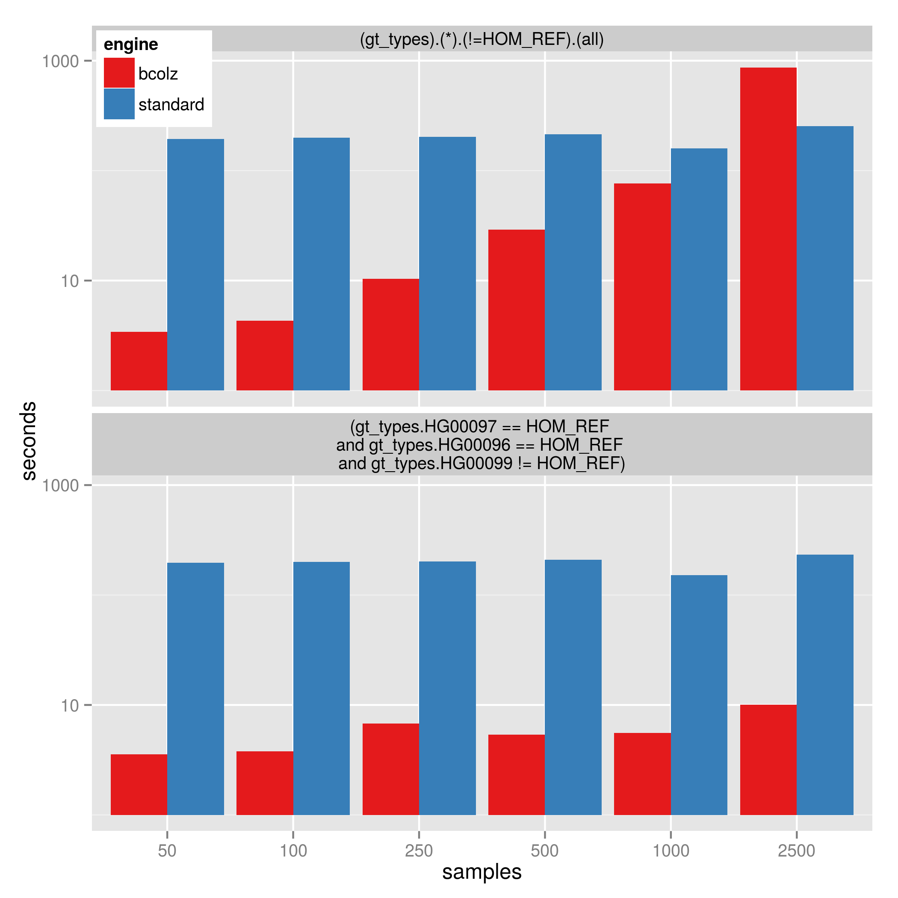

#########################
Speeding genotype queries
#########################

Design of Gemini
================

Gemini stores all genotypes information in a single column. E.g. `gt_depths`
is a single column in the sqlite database that contains information on all 
samples in a compressed and serialized array. So, in order to do a query involving
`--gt-filter` `gemini` must iterate over each row, decompress and de-serialize the
array and then evaluate the genotype filter. Even if the filter involves only a
single sample, we must deserialize the entire array. This design works quite well
and we have improved performance greatly, but for complex queries, it is quite slow.

We provide the means to index genotype fields and *optionally* use those indexes
to perform the genotype filtering.
These are external to gemini in that they do not change the behavior of `gemini`
when used without the engine.

bcolz indexes
=============

We have a implemented indexes using `bcolz <http://bcolz.blosc.org/>`_.
As of version 0.15, gemini will create the bcolz indexes by default at
the end of the database load unless `--no-bcolz` is specified.

It can be used for existing databases by creating the external indexes:

.. code-block:: bash

    gemini bcolz_index $db

This is easily parallelized by specifying a column per process, e.g.

.. code-block:: bash

     gemini bcolz_index $db --cols gt_types
     gemini bcolz_index $db --cols gt_depths # in another process

Which can index about 20K variants / second for 17 samples in our testing.
Due to a limitation in the string type in bcolz, indexing the `gts` column
is slower so we recommend not doing those queries with bcolz (e.g. gts.sample1 == 'A/C').
See note below.

It is recommended to only index the columns you'll be using in the 
`--gt-filter`.

Indexing is done only once; after that, add `--use-bcolz` to an existing gemini query command. e.g.

.. code-block:: bash

    gemini query -q "select variant_id, gts.1719PC0016 from variants"  \
        --gt-filter "gt_types.1094PC0012 == HET and gt_types.1719PC0016 == HET and gts.1094PC0012 == 'A/C'" \
        --use-bcolz \
        test/test.query.db 

This query will return identical results with or without using bcolz. It is likely
only beneficial to use `bcolz` on complex queries that are slow with the default gemini
apparatus. Queries that are more selective--e.g. return fewer rows are the best target
for speed improvement with `bcolz`

An example of the types of improvements (usually 20X to 50X) with various queries
is `here <https://gist.github.com/brentp/e2189dbfee8784ab5f13>`_.

limitations
-----------

As the number of samples grows, it becomes less beneficial to use `--gt-filter` s that
touch all samples. For example: `(gt_types).(*).(!=HOM_REF).(all)` will become slower
as samples are added since it must test every sample. However, a query like:
`(gt_types.DAD == HOM_REF and gt_types.MOM == HOM_REF and gt_types.KID != HOM_REF)` will
be much less affected by the number of samples in the database because they are only touching
3 samples.

The image below shows the time to perform the filters on a database with 1.8 million variants
and varying sample size:

1. `(gt_types).(*).(!=HOM_REF).(all)` which is affected by sample size
2. `(gt_types.DAD == HOM_REF and gt_types.MOM == HOM_REF and gt_types.KID != HOM_REF)`
   which is less affected by sample-size

Note that at 2500 samples, using bcolz is slower than the standard gemini query, however using
bcolz is consistently 30 to 50 times faster for the 2nd query. (This is up to 1000 times faster
than versions of gemini before 0.12). The y-axis is log10-scaled.

.. note ::

    indexing the 'gts' column will be much slower (only about 350 variants per second instead of
    up to 25K per second) as it must be stored as an object rather than a fixed-size numeric type.
    It will be a much larger index. So only create an index on 'gts' if necessary.

Usage
=====

First, make sure you have gemini version 0.15 or greater:

.. code-block:: bash

    gemini --version

Then, you can index an existing database (`$db`) with:

.. code-block:: bash

    gemini bcolz_index $db

Then, wherever you have a slow query that's using the `--gt-filter`, you
can add `--use-bcolz` to the query command.

.. code-block:: bash

    gemini query -q "select chrom, start, end from variants" $db \
            --use-bcolz \
            --gt-filter "gt_depth.samples1 >= 20 and gt_depth.samples2 >= 20 and gt_depth.samples3 >= 20 \
              and (gt_types.sample1 == HOM_REF and gt_types.sample2 == HOM_REF and gt_types.sample3 != HOM_REF)"

Note that nothing has changed except that `--use-bcolz` is added to the query.

Design of Genotype Query Engines
================================

This sections is for those wishing to create their own genotype query engines to plug
in to gemini and will not be needed for most users.

Genotype Query Engines can be plugged in to `gemini`. They must be
exposed with a single function:

    filter(db_path, gt_filter, user_dict)

where `db_path` is the path to the gemini sqlite database, `gt_filter` is
the genotype query string. user_dict will be pre-filled with things like
user_dict contains things like HET, UNKNOWN, etc. used in gemini.

The `filter` function must return a list of integer variant_ids that meet the specified
filter. If it can not perform the query, it must return `None`.

`gemini` will internally use the returned variant_ids to modifiy the sqlite
query to select only those rows.

The `filter` function only needs to worry about which variant_ids to return,
not how to integrate with the rest of `gemini`.
