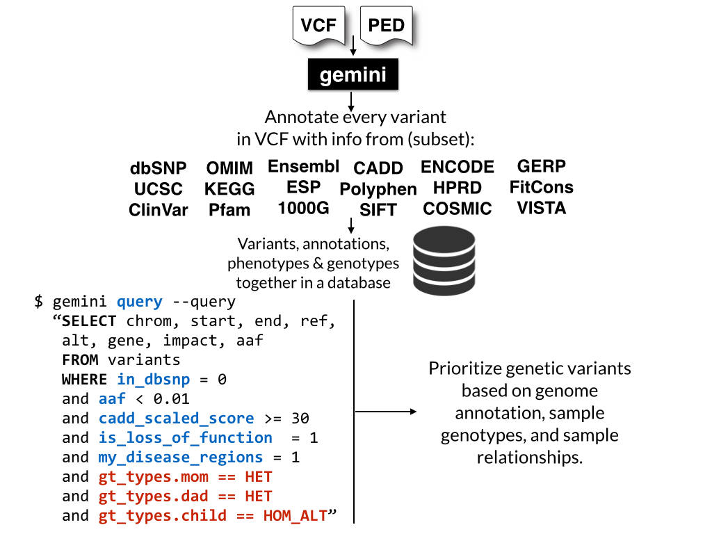

=================================================================
**GEMINI**: *a flexible framework for exploring genome variation*
=================================================================

=================
Overview
=================

GEMINI (GEnome MINIng) is designed to be a flexible framework for exploring genetic variation
in the context of the wealth of genome annotations available for the human genome.
By placing genetic variants, sample genotypes, and useful genome annotations into
an integrated database framework, ``GEMINI`` provides a simple, flexible, yet
very powerful system for exploring genetic variation for disease and
population genetics.

Using the GEMINI framework begins by loading a VCF file (and an optional PED file) into a
database.  Each variant is automatically annotated by comparing it to several
genome annotations from source such as ENCODE tracks, UCSC tracks, OMIM, dbSNP,
KEGG, and HPRD.  All of this information is stored in portable
SQLite database that allows one to explore and interpret both coding and
non-coding variation using "off-the-shelf" tools or an enhanced SQL engine.

Please also see the original `manuscript <http://www.ploscompbiol.org/article/info%3Adoi%2F10.1371%2Fjournal.pcbi.1003153>`_.

This `video <http://www.youtube.com/watch?v=p-UWmDG6yj4&t=0m40s>`_ provides more details about GEMINI's aims and
utility.

.. note::

   1. GEMINI solely supports human genetic variation mapped to build 37 (aka hg19) of the human genome.
   2. GEMINI is very strict about adherence to VCF format 4.1.
   3. For best performance, load and query GEMINI databases on the fastest hard drive to which you have access.

=================
Citation
=================
If you use GEMINI in your research, please cite the following manuscript::

    Paila U, Chapman BA, Kirchner R, Quinlan AR (2013) 
    GEMINI: Integrative Exploration of Genetic Variation and Genome Annotations. 
    PLoS Comput Biol 9(7): e1003153. doi:10.1371/journal.pcbi.1003153

=================
Table of contents
=================
.. toctree::
   :maxdepth: 2

   content/installation
   content/quick_start
   content/functional_annotation
   content/loading
   content/querying
   content/tools
   content/browser
   content/database_schema
   content/api
   content/acknowledgements
   content/caveats
   content/history
   content/faq
   content/other
   content/bugs
   content/licensing
